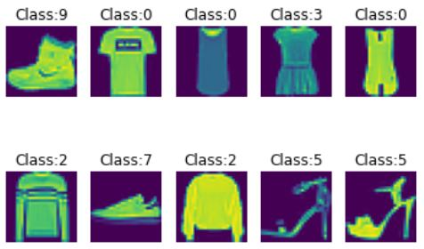

# Image Classfication using Neural Networks

## I. Repository Overview

- This repository contains different tutorials that cover building image classification models usin neural networks in `Tensorflow` framework. Currently 2 tutorial notebooks are available in this repository:
  1. `dnn_basics.ipynb`
  2. `cnn_basics.ipynb`
  
## II. Tutorial notebooks details

1. **`dnn_basics.ipynb`**
    - In this notebook I have covered how to develop a basic Dense Neural Network model in Tensorflow framework to classify image data.
    - Dataset used for analysis is the **FMNIST** image dataset available in Tensflow's dataset repository. The Dense Neural Network model tries to identify 10 different classes of fashion items in FMNIST dataset. 
      
    - The tutorial further covers how to tune the hyperparameters for a Dense Neural Network model using `keras_tuner` library 

1. **`cnn_basics.ipynb`**
    - In this notebook I have covered how to develop a basic Convolutional Neural Network model in Tensorflow framework to classify image data.
    - Dataset used for analysis is the **FMNIST** image dataset available in Tensflow's dataset repository. The Convolutional Neural Network model tries to identify 10 different classes of fashion items in FMNIST dataset.
      
    - A basic DNN model is developed first that serves as a base model. A new CNN model with different combinations of `filer & pooling` is developed. This CNN model outperform the DNN built earlier, though CNN takes more time on training.  
      
